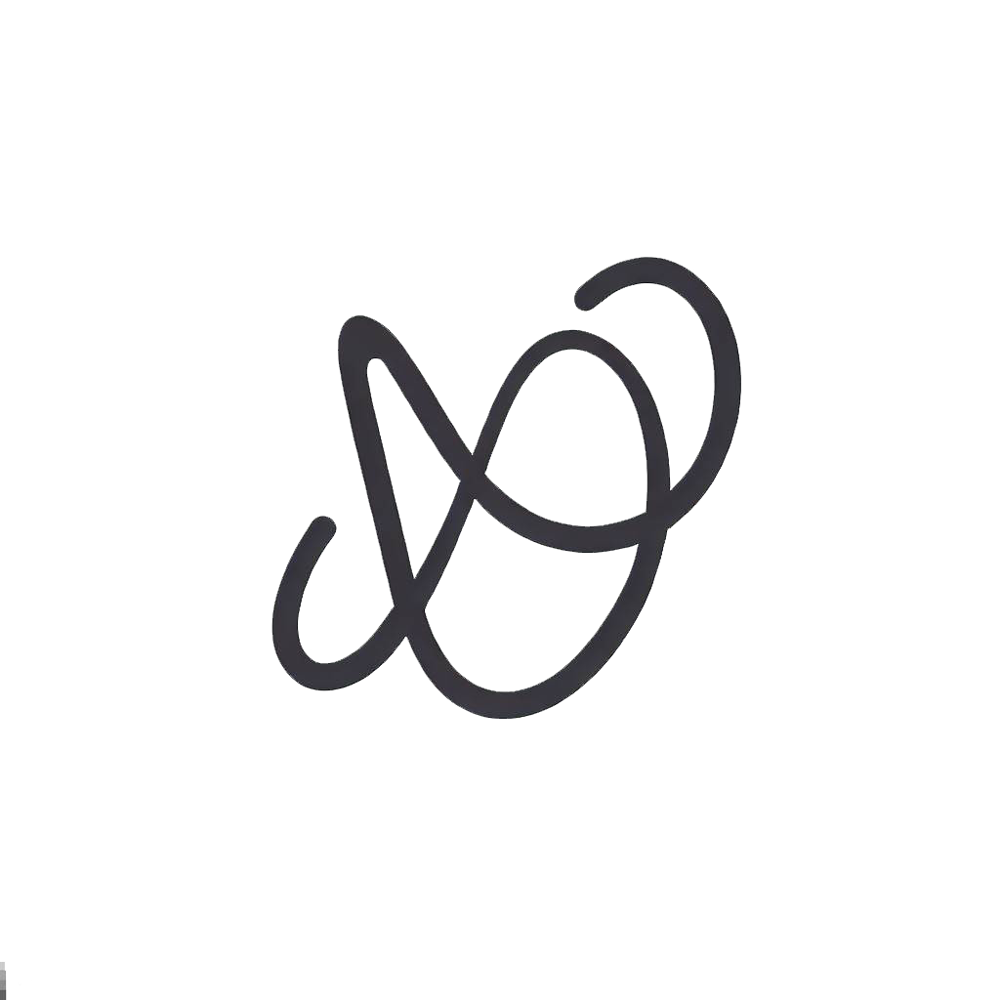

<a name="readme-top"></a>
[](https://github.com/oardilac/ChatGPT-React-Finance-Landing-Page/graphs/contributors)
[](https://github.com/oardilac/ChatGPT-React-Finance-Landing-Page/network/members)
[](https://github.com/oardilac/ChatGPT-React-Finance-Landing-Page/stargazers)
[](https://github.com/oardilac/ChatGPT-React-Finance-Landing-Page/issues)
[](https://github.com/oardilac/ChatGPT-React-Finance-Landing-Page/blob/main/LICENSE)
[](https://www.linkedin.com/in/oardilac/)
<!-- PROJECT LOGO -->
<br />
<div align="center">
  <a href="https://github.com/oardilac/ChatGPT-React-Finance-Landing-Page.git">
    
  </a>
<br />
<div align="center">
    <h3 align="center">AI Empowered Investments Landing Page</h3>

   <p align="center">
    An impressive landing page for the side project!
    <br />

  <p align="center">
    <a href="https://github.com/oardilac/ChatGPT-React-Finance-Landing-Page/"><strong>Explore the docs »</strong></a>
    <br />
    <br />
    <a href="https://github.com/oardilac/ChatGPT-React-Finance-Landing-Page/">View Demo</a>
    ·
    <a href="https://github.com/oardilac/ChatGPT-React-Finance-Landing-Page/issues">Report Bug</a>
    ·
    <a href="https://github.com/oardilac/ChatGPT-React-Finance-Landing-Page/issues">Request Feature</a>
  </p>
</div>


<!-- TABLE OF CONTENTS -->
<details>
  <summary>Table of Contents</summary>
  <ol>
    <li>
      <a href="#about-the-project">About The Project</a>
      <ul>
        <li><a href="#built-with">Built With</a></li>
      </ul>
    </li>
    <li>
      <a href="#getting-started">Getting Started</a>
      <ul>
        <li><a href="#prerequisites">Prerequisites</a></li>
        <li><a href="#installation">Installation</a></li>
      </ul>
    </li>
    <li><a href="#usage">Usage</a></li>
    <li><a href="#roadmap">Roadmap</a></li>
    <li><a href="#contributing">Contributing</a></li>
    <li><a href="#license">License</a></li>
    <li><a href="#contact">Contact</a></li>
    <li><a href="#acknowledgments">Acknowledgments</a></li>
  </ol>
</details>

<!-- ABOUT THE PROJECT -->
## About The Project

<a href="https://chat-gpt-react-finance-landing-page.vercel.app/">
  
</a>

Welcome to your landing page for your side project! This project is a modern, visually appealing landing page built to attract and retain users. It's clean, responsive, and easy to customize. Here's why:

* The landing page is the first point of contact between your project and potential users. A stunning landing page will create a strong impression and encourage users to explore more.
* It's fully responsive, which means it looks great on devices of all sizes, from large desktop monitors to mobile phones.
* The code is clean and well-organized, making it easy for you to update or customize the landing page to suit your needs.

Please explore the rest of this README to learn how to set up your project, how to use it, and how to contribute. Thanks to all who have contributed to this project!

<p align="right">(<a href="#readme-top">back to top</a>)</p>

### Built With

This project uses these major frameworks:

* [](https://reactjs.org/)
* [](https://tailwindcss.com/)

<p align="right">(<a href="#readme-top">back to top</a>)</p>

<!-- GETTING STARTED -->
## Getting Started

To set up a local copy of the project, follow these steps.

### Prerequisites

You need npm installed on your machine to run this project.

    ```sh
    npm install npm@latest -g
    ```
### Installation

1. Clone the repo

    ```
    git clone https://github.com/oardilac/ChatGPT-React-Finance-Landing-Page.git
    ```

2. Install NPM packages

    ```
    npm install
    ```

3. Start the development server
    ```
    npm run dev
    ```

<p align="right">(<a href="#readme-top">back to top</a>)</p>

<!-- USAGE EXAMPLES -->
## Usage

To use the app, you need to run the command 'npm start' and navigate to 'http://localhost:5173/' in your browser. This app has a single page that shows a hero section with your project's logo, a headline text and a button.


<p align="right">(<a href="#readme-top">back to top</a>)</p>


<!-- ROADMAP -->
## Roadmap

- [x] Add Changelog
- [x] Add back to top links
- [ ] Add Additional Templates w/ Examples
- [ ] Add "components" document to easily copy & paste sections of the readme
- [ ] Multi-language Support
    - [ ] Chinese
    - [ ] Spanish

<!-- CONTRIBUTING -->
## Contributing
Contributions are what make the open-source community such an amazing place to learn, inspire, and create. Any contributions you make are **greatly appreciated**.

1. Fork the Project
2. Create your Feature Branch (git checkout -b feature/AmazingFeature)
3. Commit your Changes (git commit -m 'Add some AmazingFeature')
4. Push to the Branch (git push origin feature/AmazingFeature)
5. Open a Pull Request

<p align="right">(<a href="#readme-top">back to top</a>)</p>

<!-- LICENSE -->
## License
Distributed under the MIT License. See `LICENSE` for more information.

<p align="right">(<a href="#readme-top">back to top</a>)</p>


<!-- CONTACT -->
## Contact

Oliver Ardila - @oardilac - odardilacueto@gmail.com

Project Link: [https://github.com/oardilac/ChatGPT-React-Finance-Landing-Page](https://github.com/oardilac/ChatGPT-React-Finance-Landing-Page)

<p align="right">(<a href="#readme-top">back to top</a>)</p>

<!-- ACKNOWLEDGMENTS -->
## Acknowledgments

This project wouldn't be possible without these awesome resources. We would like to take a moment to thank:

* [React.js](https://reactjs.org/) - A JavaScript library for building user interfaces.
* [Tailwind CSS](https://tailwindcss.com/) - A utility-first CSS framework packed with classes like `flex`, `pt-4`, `text-center` and more.
* [Poppins](https://fonts.google.com/specimen/Poppins) - A geometric sans serif typeface from Google Fonts used in the project.
* [Google Fonts](https://fonts.google.com/) - A library of 1052 free licensed fonts, an interactive web directory for browsing the library.
* [Substack](https://oliverardila.substack.com/?showWelcome=true) - A platform for newsletter subscriptions and an important part of the application.
* [Img Shields](https://shields.io) - For providing README badges.
* [Vercel](https://vercel.com/) - For hosting the project's website.
* [Font Awesome](https://fontawesome.com) - For providing a vast collection of icons.

Furthermore, we are thankful to the whole open-source community. We appreciate the hard work of developers who create and maintain these resources. We encourage you to check out these resources and contribute to them if you can.

<p align="right">(<a href="#readme-top">back to top</a>)</p>